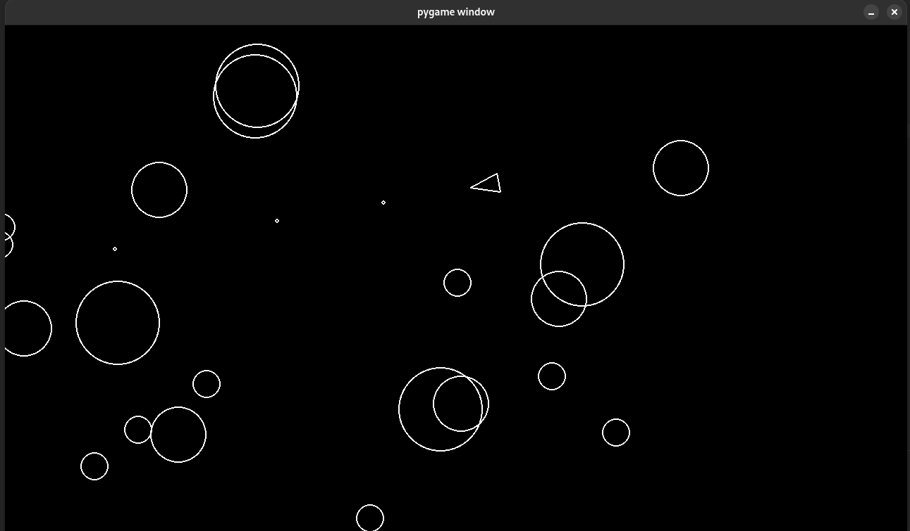

# Simple Astroid game in Python

This is a simple asteroid game written in Python using the Pygame library.

## How to run

1. Install Python 3.x
2. Install Pygame
3. Run `python src/main.py`

## How to play

Use the arrow keys to move the player and shoot with the space bar.

